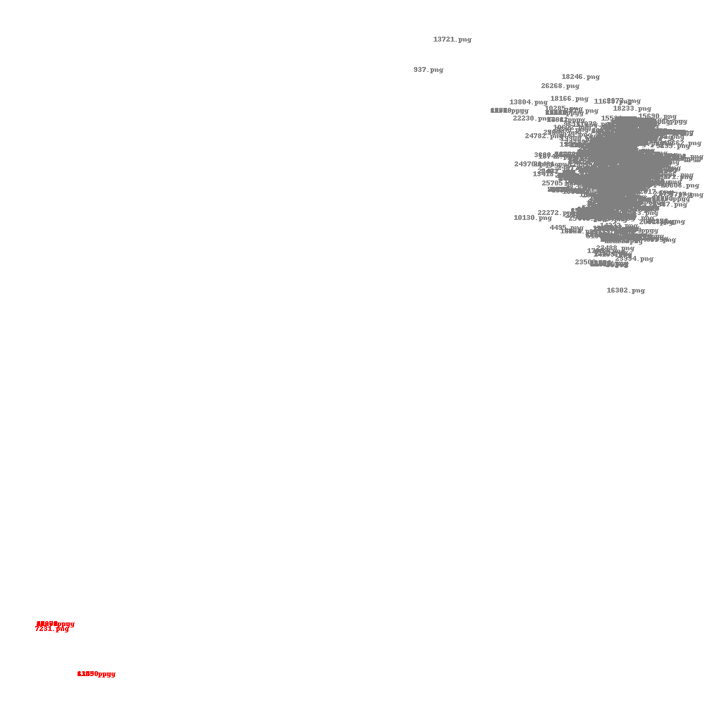

# MNIST-with-anomaly-datasets
MNIST with anomaly datasets

動作環境：

* Python3
* Chainer3

詳しい解説

## データセット

train.zip - ラベル付けされたMNISTの手書き数字画像21,038枚

test.zip - ラベル付けされたMNISTの手書き数字画像20,962枚

anomaly.zip - ラベル付けされてにない画像28,000枚で、内MNISTの手書き数字画像が27990枚、例外画像10枚

## プログラム

autoencoder.py - オートエンコーダーで分散表現化

find_anomaly.py - Metric Learningによる例外画像の検出

## License

[Gnu AGPL 3.0](LICENSE)
